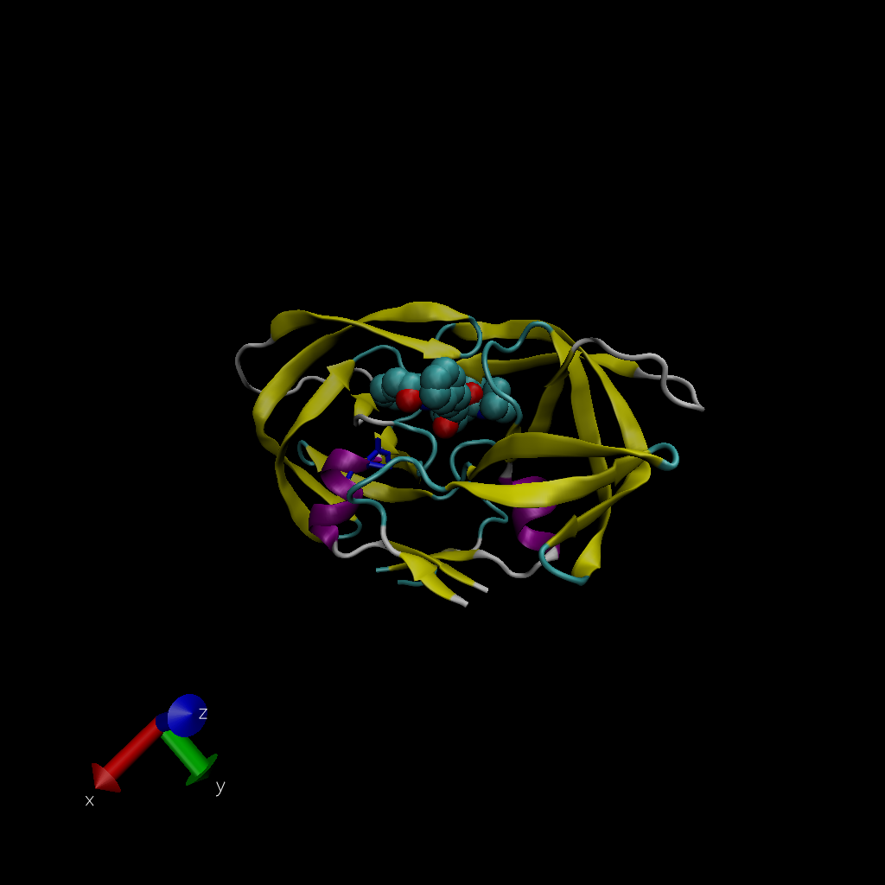

## A quick look into PDB

```{r}
db <- read.csv("Data Export Summary.csv", row.names = 1)
head(db)
```

> **Q1:** What percentage of structures in the PDB are solved by X-Ray and Electron Microscopy.

```{r}
method.sums <- colSums(db)
round((method.sums/method.sums["Total"]) * 100,2)
```

X-ray is 87.55% and EM is 4.92%.

> **Q2:** What proportion of structures in the PDB are protein?

```{r}
round((db$Total/method.sums["Total"]) * 100, 2)
```

87.36% are protein.

> **Q3:** Type HIV in the PDB website search box on the home page and determine how many HIV-1 protease structures are in the current PDB?

There are 1828 HIV-1 protease structures in the current PDB.

## VMD structure visualization image



> **Q4:** Water molecules normally have 3 atoms. Why do we see just one atom per water molecule in this structure?

Hydrogen atoms are too small to see compared to oxygen, since it is the smallest atom. 

> **Q5:** There is a conserved water molecule in the binding site. Can you identify this water molecule? What residue number does this water molecule have (see note below)?

MK1902. 

## Using Bio3D

I need to load the library. 
```{r}
library(bio3d)

pdb <- read.pdb("1hsg")
pdb
aa123(pdbseq(pdb))
```

Plot of B-factor

```{r}
plot.bio3d(pdb$atom$b, sse = pdb)
```

The ATOM records

```{r}
head(pdb$atom)
```

